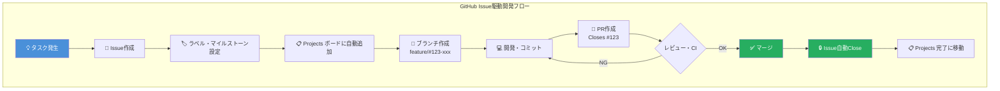
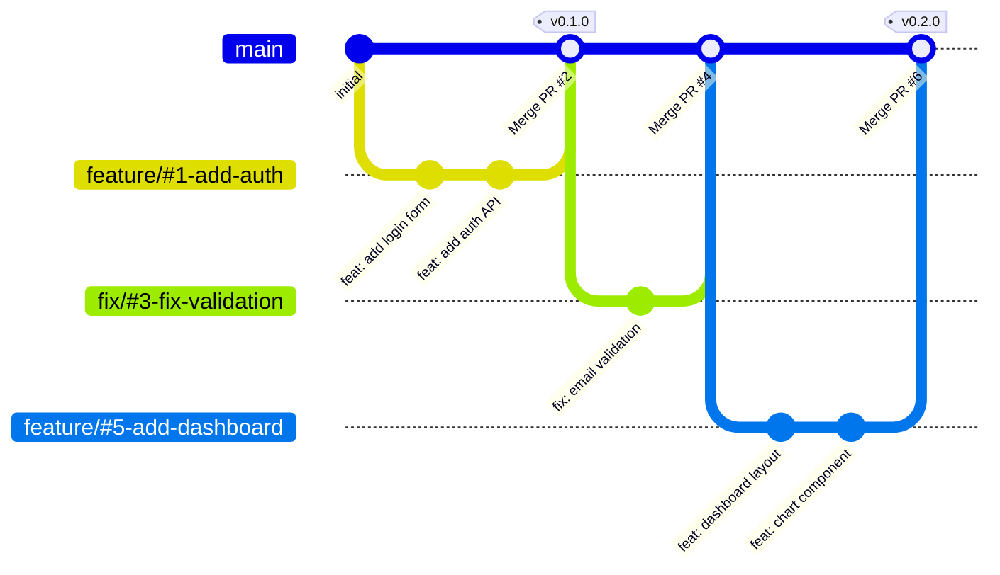
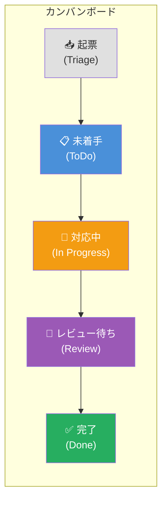
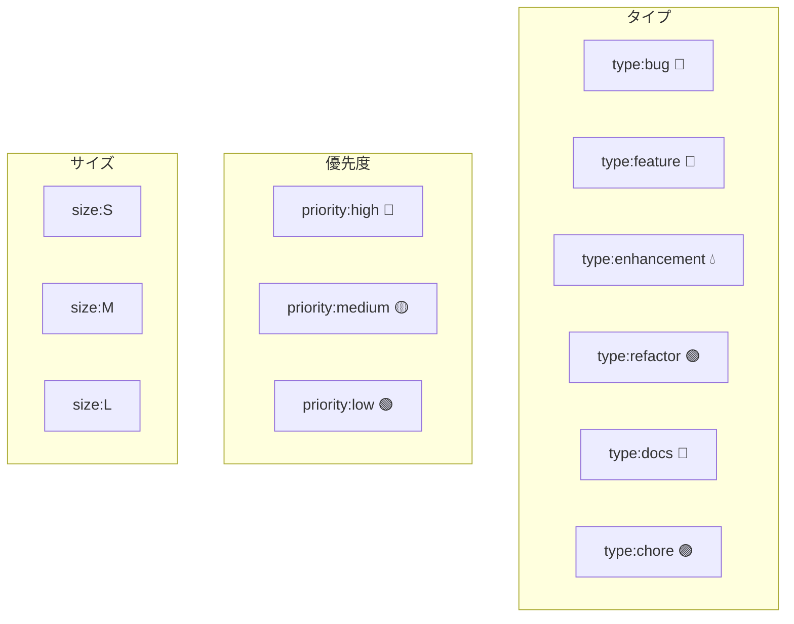
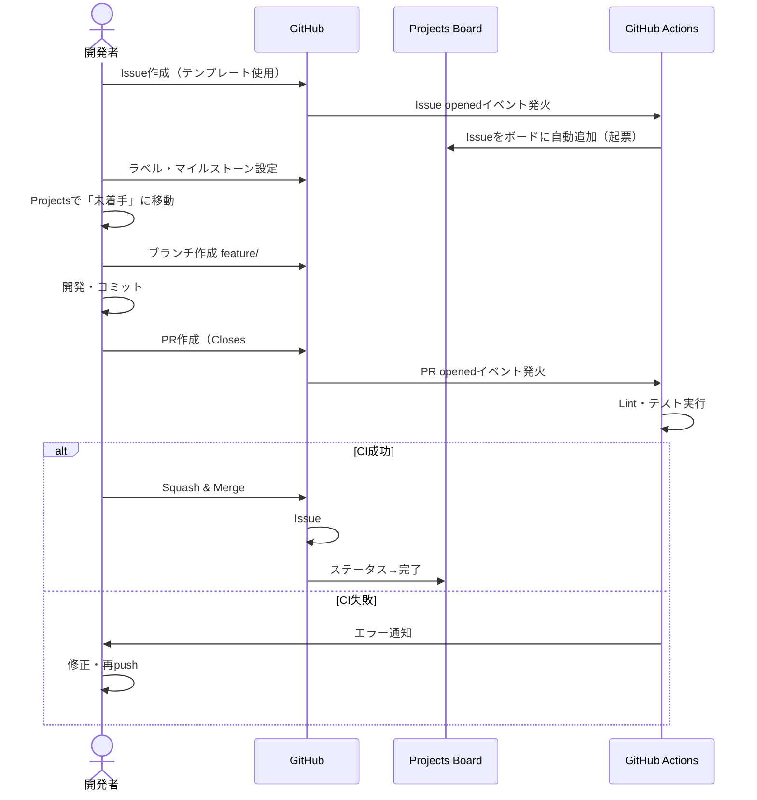
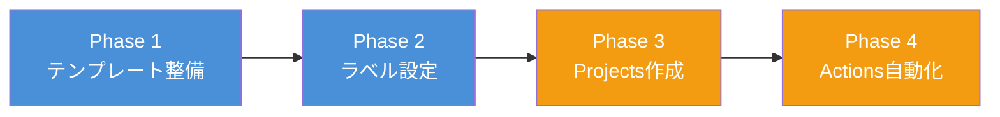

# features/git — GitHub プロジェクト管理機能 設計書

作成日: 2026-03-26
ステータス: 設計中

---

## 1. 概要・目的

company リポジトリに Issue 駆動開発の基盤を整備する。
すべての作業は Issue から始まり、ブランチ→PR→マージ→Close のサイクルで管理する。

### 解決する課題
- タスクが散在して追跡できない
- なぜこのコードを変更したのか半年後に追えない
- プロジェクトの全体像が見えない

---

## 2. 全体アーキテクチャ



---

## 3. ブランチ戦略: GitHub Flow



### ルール
- 永続ブランチは `main` のみ（常にデプロイ可能）
- `main` への直接 push 禁止
- マージは **Squash and Merge**（履歴をきれいに保つ）
- リリースは **タグ** で管理（`v1.0.0` 形式）

### ブランチ命名規則
```
feature/#<Issue番号>-<簡潔な説明>   例: feature/#42-add-user-auth
fix/#<Issue番号>-<簡潔な説明>       例: fix/#55-fix-null-check
hotfix/#<Issue番号>-<簡潔な説明>    例: hotfix/#60-critical-security
docs/#<Issue番号>-<簡潔な説明>      例: docs/#70-update-api-docs
```

---

## 4. GitHub Projects ボード設計



### ステータス定義

| ステータス | 意味 | 自動化 |
|-----------|------|--------|
| 起票 | Issue作成直後 | Issue作成時に自動設定 |
| 未着手 | 優先度決定済み、着手待ち | 手動 |
| 対応中 | 作業中 | ブランチ作成で自動移動(将来) |
| レビュー待ち | PR作成済み、確認待ち | PR作成で自動移動(将来) |
| 完了 | マージ・クローズ済み | Issue Close時に自動移動 |

### カスタムフィールド

| フィールド | 値 | 用途 |
|-----------|-----|------|
| 優先度 | 🔴 High / 🟡 Medium / 🟢 Low | 着手順の判断 |
| サイズ | S(〜1h) / M(〜半日) / L(1日〜) | 見積もり |

---

## 5. ラベル設計



### labels.json

```json
[
  {"name": "type:bug",          "color": "FC2C2B", "description": "不具合の修正"},
  {"name": "type:feature",      "color": "0E4BDB", "description": "新機能の追加"},
  {"name": "type:enhancement",  "color": "A2EEEF", "description": "既存機能の改善"},
  {"name": "type:refactor",     "color": "AFD38D", "description": "リファクタリング"},
  {"name": "type:docs",         "color": "F4BFD0", "description": "ドキュメント"},
  {"name": "type:chore",        "color": "D4C5F9", "description": "設定変更・雑務"},
  {"name": "priority:high",     "color": "B60205", "description": "最優先"},
  {"name": "priority:medium",   "color": "FBCA04", "description": "通常"},
  {"name": "priority:low",      "color": "0E8A16", "description": "余裕があれば"},
  {"name": "size:S",            "color": "EDEDED", "description": "〜1時間"},
  {"name": "size:M",            "color": "C5DEF5", "description": "〜半日"},
  {"name": "size:L",            "color": "BFD4F2", "description": "1日以上"}
]
```

---

## 6. Issueライフサイクル（シーケンス図）



---

## 7. ファイル構成（実装するもの）

```
.github/
├── ISSUE_TEMPLATE/
│   ├── bug_report.yml          # バグ報告テンプレート
│   ├── feature_request.yml     # 機能リクエストテンプレート
│   └── config.yml              # 空Issue無効化
├── pull_request_template.md    # PRテンプレート
├── labels.json                 # ラベル定義
└── workflows/
    ├── add-to-project.yml      # Issue→Project自動追加
    ├── sync-labels.yml         # ラベル自動同期
    └── deploy-docs.yml         # (既存)
```

---

## 8. 実装フェーズ



| フェーズ | 内容 | 前提 |
|---------|------|------|
| Phase 1 | Issue/PRテンプレート配置 | なし |
| Phase 2 | labels.json作成・ラベル同期 | gh auth済み |
| Phase 3 | GitHub Projects ボード作成 | gh auth済み |
| Phase 4 | GitHub Actions（自動追加・ラベル同期） | PAT設定 |

---

## 9. 受け入れ条件

- [ ] Issue テンプレート2種（バグ報告・機能リクエスト）が使える
- [ ] PRテンプレートが PR作成時に自動表示される
- [ ] ラベルが labels.json 通りに設定されている
- [ ] GitHub Projects ボードが5ステータスで作成されている
- [ ] Issue作成時に Projects へ自動追加される
- [ ] ブランチ命名規則が CLAUDE.md に記載されている
