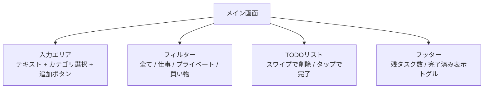

# TODO アプリ 設計書

作成日: 2026-03-26
ステータス: 実装中

---

## 概要
React Native (Expo) で Android / iOS 両対応の TODO アプリを作成する。

## 技術選定
- **React Native + Expo** (Managed workflow)
- **TypeScript**
- **AsyncStorage** (ローカル永続化)
- **Expo Router** (ナビゲーション不要、単画面)

## 機能
- TODO の追加・完了・削除
- カテゴリ（仕事 / プライベート / 買い物）
- 完了済みの表示/非表示トグル
- データはローカルに永続化（AsyncStorage）

## 画面構成

## 受け入れ条件
- [ ] TODO の追加ができる
- [ ] TODO をタップで完了/未完了を切替できる
- [ ] TODO をスワイプまたはボタンで削除できる
- [ ] カテゴリでフィルタできる
- [ ] アプリ再起動後もデータが残る
- [ ] Android / iOS 両方でビルドが通る
