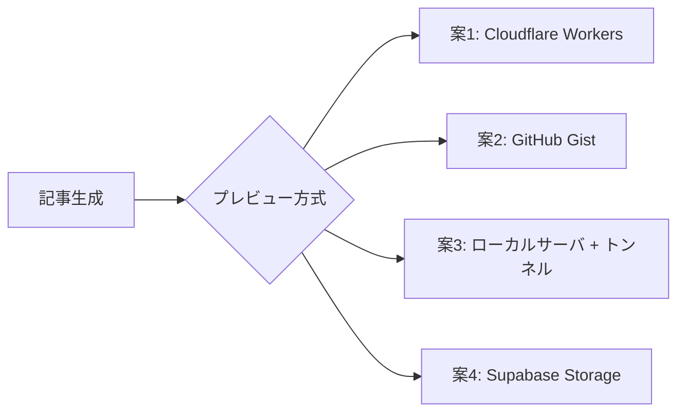
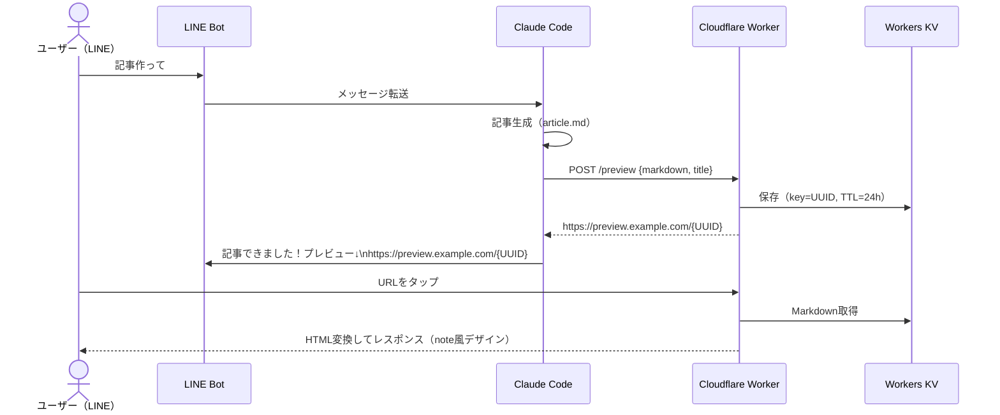
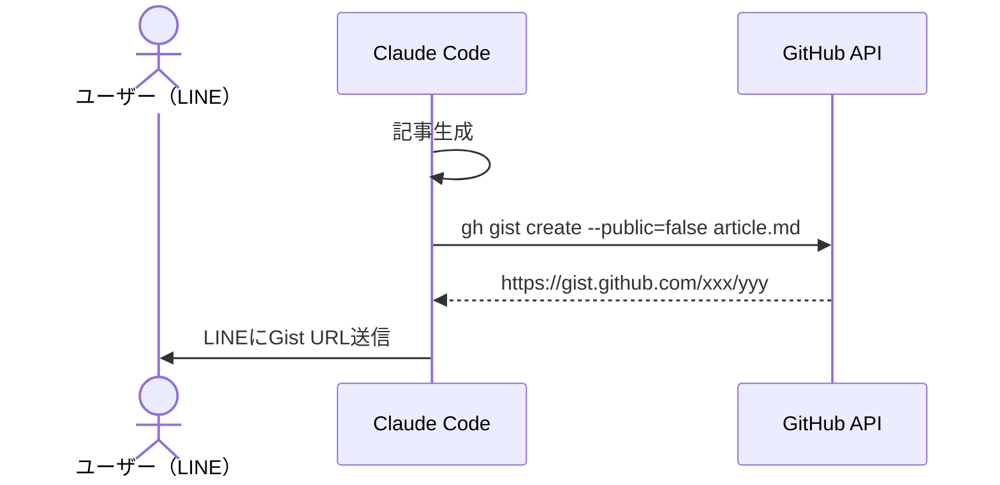
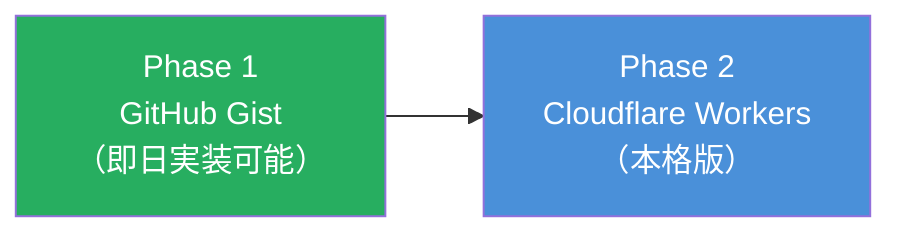

# 記事プレビュー機能 設計書

作成日: 2026-03-27
ステータス: 計画段階

---

## 課題
LINEから「記事作って」と依頼 → 記事が生成される → **確認する手段がない**。
PCの前にいなくてもスマホ（LINE上）で記事をプレビューしたい。

## 要件
- 記事生成後に**一時的なURL**を発行する
- LINEにURLを送れば、スマホブラウザで記事をプレビューできる
- 外部に公開しない or 一定時間で消える
- 追加サービスのコスト最小限

---

## 方式比較



| 方式 | コスト | セットアップ | セキュリティ | 永続性 | おすすめ度 |
|------|--------|-------------|-------------|--------|-----------|
| **Cloudflare Workers** | 無料枠10万req/日 | 中 | UUID付きURLで実質非公開 | 自由に設定可能 | ★★★★★ |
| **GitHub Gist** | 無料 | 低 | Secret Gistでも URL知ってれば見れる | 手動削除 | ★★★☆☆ |
| **ローカル + cloudflared** | 無料 | 低 | PC起動中のみ | PC停止で消える | ★★★☆☆ |
| **Supabase Storage** | 無料枠1GB | 中 | Signed URL（期限付き） | 期限付き自動失効 | ★★★★☆ |

---

## 推奨案: Cloudflare Workers（KV）

### なぜ
- dev部門のスタックに既にCloudflareがある
- 無料枠が大きい（10万リクエスト/日）
- Workers KVにMarkdownを保存 → HTMLに変換して返す
- UUID付きURLで実質非公開
- TTL（有効期限）を設定すれば自動削除

### アーキテクチャ



### URL形式
```
https://preview.netrunners.workers.dev/{UUID}
```
- UUIDは推測不可能（128bit）
- 24時間で自動失効（KVのTTL）
- 必要ならパスワード保護も追加可能

### Worker の処理

```
POST /preview  → KVに保存、UUID返却
GET  /{uuid}   → KVから取得、Markdown→HTML変換、note風CSSで表示
```

### 表示イメージ（note風）
- ダークモード対応
- Noto Serif JP / Noto Sans JP
- 見出し・太字・引用・リストを正しくレンダリング
- 「これはプレビューです」バナー表示
- 「投稿する」「修正する」ボタン（LINE Botに指示を送るDeep Link）

---

## 代替案: GitHub Gist（最速で実装可能）



### メリット
- `gh gist create` 1コマンドで完了
- Markdownレンダリング済みで表示される
- 実装コスト: ほぼゼロ

### デメリット
- Secret Gistでもログインなしで見れてしまう（URLを知っていれば）
- 自動削除なし（手動 or スクリプトで定期削除）
- デザインはGitHub固定（note風にできない）

---

## 実装フェーズ



| Phase | 内容 | 工数 |
|-------|------|------|
| **Phase 1** | `gh gist create` でプレビューURL生成。LINEに送信。 | 30分 |
| **Phase 2** | Cloudflare Workers + KV でnote風プレビュー。TTL自動失効。 | 半日 |

---

## Phase 1 の実装イメージ（gh gist）

```bash
# 記事生成後に実行
GIST_URL=$(gh gist create --filename "article.md" \
  -d "プレビュー: $(cat title.txt)" \
  article.md 2>&1 | grep "https://")

# LINEに送信
notify.sh "📝 記事できました！\nタイトル: $(cat title.txt)\nプレビュー: $GIST_URL"
```

## 実装状況

### ファイル構成
```
features/preview/
├── wrangler.toml         # Cloudflare Workers設定
├── src/
│   └── index.ts          # Worker本体（POST /preview, GET /{uuid}）
└── create-preview.sh     # プレビューURL発行ヘルパー
```

### デプロイ手順
```bash
cd features/preview

# 1. KV namespace作成
npx wrangler kv namespace create PREVIEWS
# → 出力されたidをwrangler.tomlに記入

# 2. デプロイ
npx wrangler deploy

# 3. 環境変数にWorker URLを設定
export PREVIEW_WORKER_URL=https://article-preview.netrunners.workers.dev
```

### 使い方
```bash
# プレビューURL発行
URL=$(bash features/preview/create-preview.sh title.txt article.md)

# LINEに送信
bash company/integrations/line/notify.sh "📝 記事プレビュー: $URL"
```

### LINE Botとの連携フロー
1. LINE「記事作って」→ line-agent.sh → Claude Code → 記事生成
2. create-preview.sh → Cloudflare Workers → プレビューURL
3. LINE返信「記事できました！プレビュー: https://.../{uuid}」
4. ユーザーがURLタップ → note風デザインで記事閲覧
5. LINE「投稿して」→ post_to_note.py → note下書き保存

## 受け入れ条件

- [ ] `npx wrangler deploy` でWorkerがデプロイされる
- [ ] POST /preview でプレビューURLが発行される
- [ ] GET /{uuid} でnote風HTMLが表示される
- [ ] 24時間後にKVからデータが自動削除される
- [ ] create-preview.sh でURLが取得できる
- [ ] LINEにURLを送信してスマホで記事を読める
- [ ] 見出し・太字・引用・リストが正しく表示される
