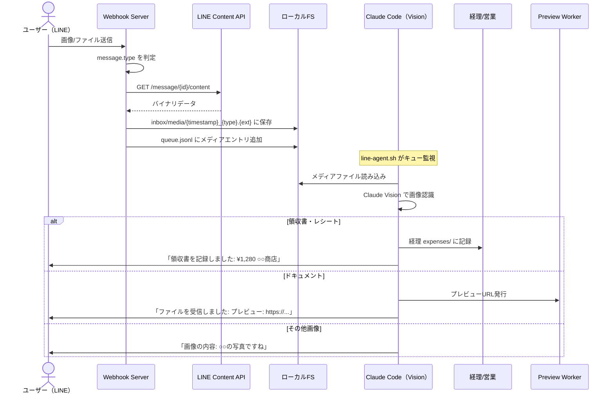
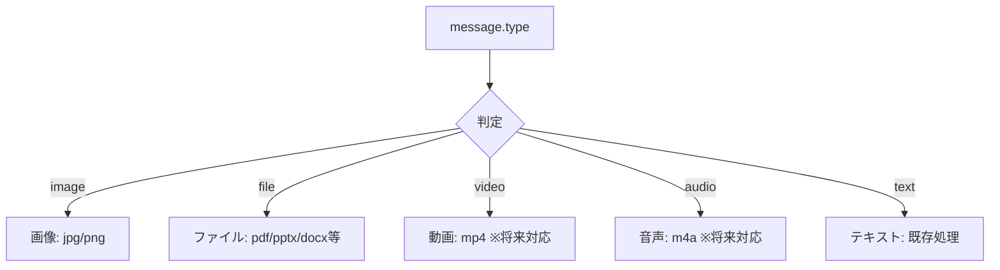
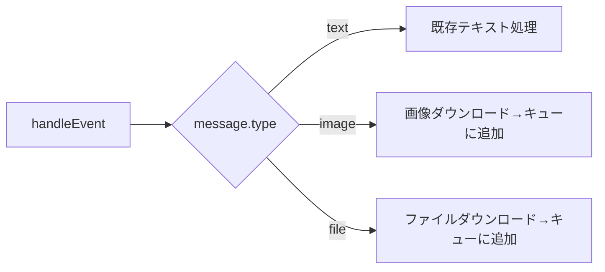
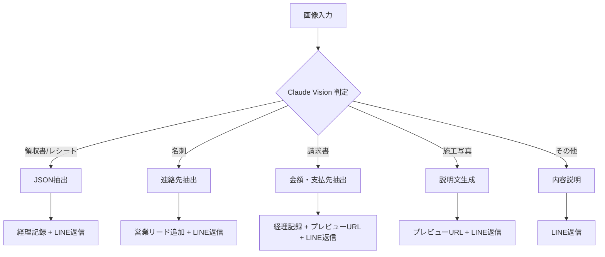
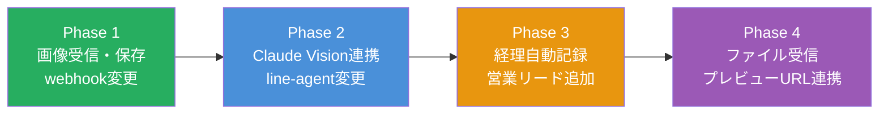

# LINE メディア受信・画像認識機能 設計書

作成日: 2026-03-27
ステータス: 計画段階

---

## 概要
LINEから送信された画像・ファイルを受信し、Claude Codeの画像認識（Vision）で内容を解析。
用途に応じて経理記録・ファイル保存・プレビューURL発行まで自動化する。

## ユースケース

| ユースケース | 入力 | 処理 | 出力 |
|------------|------|------|------|
| 領収書・レシート | 写真 | OCR→金額・日付・店名抽出 | 経理の経費ファイルに自動記録 + LINE返信 |
| 請求書受領 | PDF/写真 | 内容読み取り→要約 | 経理に記録 + プレビューURL |
| 名刺 | 写真 | 氏名・会社名・連絡先抽出 | 営業のリードに追加 |
| 施工写真 | 写真 | 保存 + 説明文生成 | プレビューURL + LINE返信 |
| ドキュメント | PDF/PPTX/DOCX | 保存 + 要約 | プレビューURL + LINE返信 |
| その他画像 | 写真 | 内容を説明 | LINE返信 |

---

## アーキテクチャ



---

## 対応するLINEメッセージタイプ



### LINE Content API

```
GET https://api-data.line.me/v2/bot/message/{messageId}/content
Authorization: Bearer {ACCESS_TOKEN}
→ バイナリデータ（Content-Type ヘッダーでMIME取得）
```

---

## 変更対象ファイル

### 1. webhook-server.mjs（メディア受信追加）

現状: `event.message.type === "text"` のみ処理
変更: `image` / `file` タイプを追加



処理フロー:
1. LINE Content APIからバイナリ取得
2. `inbox/media/` に保存（ファイル名: `{timestamp}_{messageId}.{ext}`）
3. `queue.jsonl` にメディアエントリを追加

```json
{
  "timestamp": "2026-03-27T10:00:00Z",
  "userId": "Uxxx",
  "type": "image",
  "mediaPath": "inbox/media/20260327-100000_img.jpg",
  "originalFilename": null
}
```

ファイルの場合:
```json
{
  "timestamp": "2026-03-27T10:00:00Z",
  "userId": "Uxxx",
  "type": "file",
  "mediaPath": "inbox/media/20260327-100000_receipt.pdf",
  "originalFilename": "receipt.pdf"
}
```

### 2. line-agent.sh（メディア処理追加）

キューからメディアエントリを読み取った場合の処理を追加:

```bash
# キューエントリにmediaPathがあればメディア処理
if [ -n "$MEDIA_PATH" ]; then
  # Claude Code Vision で画像認識
  RESULT=$(claude --dangerously-skip-permissions -p \
    "この画像を分析してください。
     領収書/レシートなら: 日付、金額、店名、内容をJSON抽出
     名刺なら: 氏名、会社、役職、連絡先をJSON抽出
     ドキュメントなら: 内容を要約
     その他: 内容を簡潔に説明
     画像パス: $MEDIA_PATH" \
    2>/dev/null)
fi
```

### 3. 経理自動記録

領収書と判定された場合、経理の経費ファイルに自動追記:

```
company/back-office/accounting/expenses/YYYY-MM.md
```

形式:
```markdown
| 2026-03-27 | ○○商店 昼食代 | ¥1,280 | 交際費 | LINE受信・自動記録 |
```

---

## ファイル保存構成

```
features/line/
├── inbox/
│   ├── queue.jsonl         # 処理キュー（テキスト+メディア）
│   ├── messages.jsonl      # テキストログ
│   ├── conversation.log    # 会話履歴
│   └── media/              # 画像・ファイル保存（NEW）
│       ├── 20260327-100000_img.jpg
│       ├── 20260327-100500_receipt.pdf
│       └── ...
```

---

## 画像認識パターン（Claude Vision プロンプト設計）



### プロンプト例

```
あなたはLINEから受信した画像を分析するアシスタントです。

画像を見て、以下のいずれかに分類し、対応する情報を抽出してください。

## 分類と抽出ルール

### 領収書・レシート
JSONで返す:
{"type":"receipt","date":"YYYY-MM-DD","amount":1280,"store":"○○商店","items":"昼食代","category":"交際費"}

### 名刺
JSONで返す:
{"type":"namecard","name":"山田太郎","company":"○○株式会社","title":"部長","phone":"03-xxxx-xxxx","email":"xxx@xxx.com"}

### 請求書
JSONで返す:
{"type":"invoice","from":"○○会社","amount":50000,"due_date":"2026-04-30","description":"コンサルティング費"}

### その他
{"type":"other","description":"画像の内容を1-2文で説明"}
```

---

## 実装フェーズ



| Phase | 内容 | 変更ファイル |
|-------|------|------------|
| **Phase 1** | webhook-server.mjs に image/file 受信・保存を追加 | webhook-server.mjs |
| **Phase 2** | line-agent.sh にメディア判定・Claude Vision呼び出しを追加 | line-agent.sh |
| **Phase 3** | 経理自動記録（expenses/に追記）、営業リード追加 | line-agent.sh |
| **Phase 4** | ファイル受信 → プレビューURL発行 → LINE返信 | line-agent.sh, create-preview.sh |

---

## 受け入れ条件

- [ ] LINEから画像を送信すると `inbox/media/` に保存される
- [ ] 領収書の画像を送ると、金額・日付・店名が抽出されてLINEに返信される
- [ ] 領収書の内容が `company/back-office/accounting/expenses/YYYY-MM.md` に自動記録される
- [ ] 名刺の画像を送ると、連絡先が抽出されてLINEに返信される
- [ ] PDFを送ると、プレビューURLが発行されてLINEに返信される
- [ ] PPTXを送ると、プレビューURL（スライドビューア）が発行されてLINEに返信される
- [ ] 対応外の画像を送ると、内容の説明がLINEに返信される

## 制約・注意事項

- LINE Content APIの画像は送信後一定期間（公式未公表、概ね数日）で取得不可になる → 即座にダウンロード・保存する
- Claude Codeの `--image` フラグ、または `Read` ツールで画像を渡す
- 画像サイズ上限: LINEは最大200MB。Claude Visionの入力上限に注意
- 経理自動記録は「追記のみ」。既存データを上書きしない
