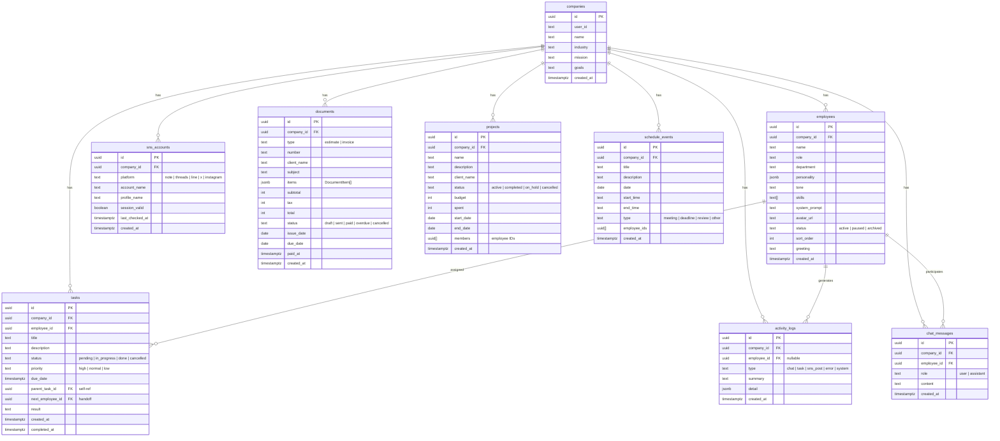

# AI Company - ER Diagram

## Relationships

| Parent | Child | Type | ON DELETE |
|--------|-------|------|----------|
| companies | employees | 1:N | CASCADE |
| companies | tasks | 1:N | CASCADE |
| companies | sns_accounts | 1:N | CASCADE |
| companies | activity_logs | 1:N | CASCADE |
| companies | chat_messages | 1:N | CASCADE |
| companies | documents | 1:N | CASCADE |
| companies | projects | 1:N | CASCADE |
| companies | schedule_events | 1:N | CASCADE |
| employees | tasks | 1:N | SET NULL |
| employees | activity_logs | 1:N | SET NULL |
| employees | chat_messages | 1:N | CASCADE |
| tasks | tasks (parent) | self-ref | - |
| employees | tasks (next) | handoff | - |

## Notes

- `companies` が全テーブルの親。マルチテナントの基点。
- `tasks.parent_task_id` で親子タスク、`next_employee_id` で社員間のタスクハンドオフ。
- `projects.members` と `schedule_events.employee_ids` は UUID 配列（正規化よりシンプルさ優先）。
- `documents.items` は JSONB 配列（`{name, quantity, unitPrice, amount}[]`）。
