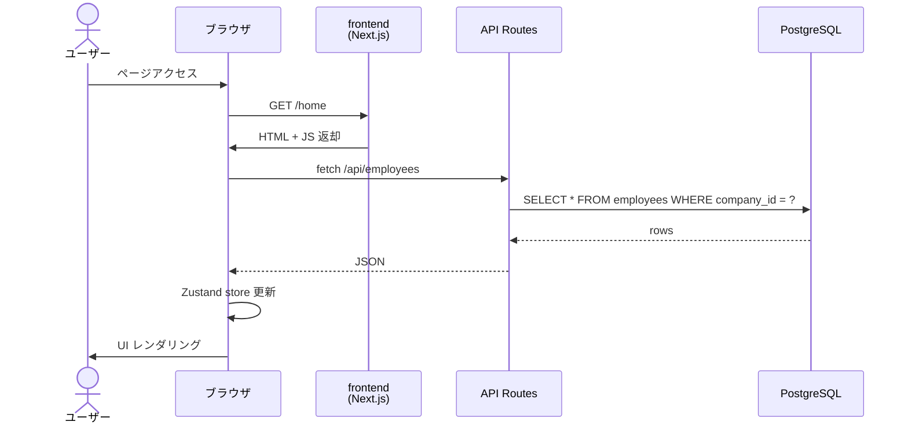
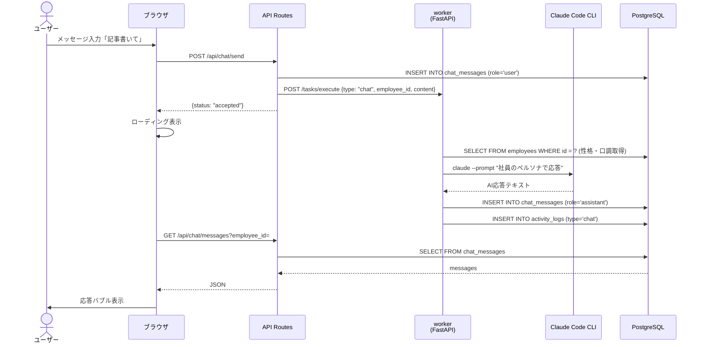
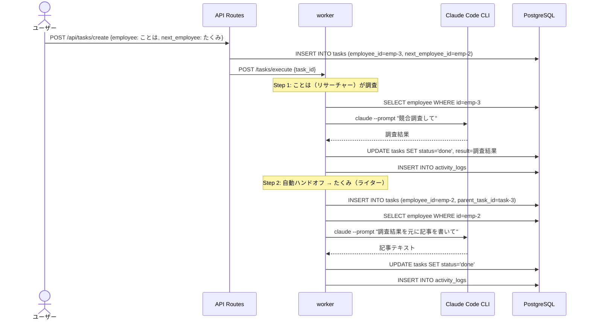
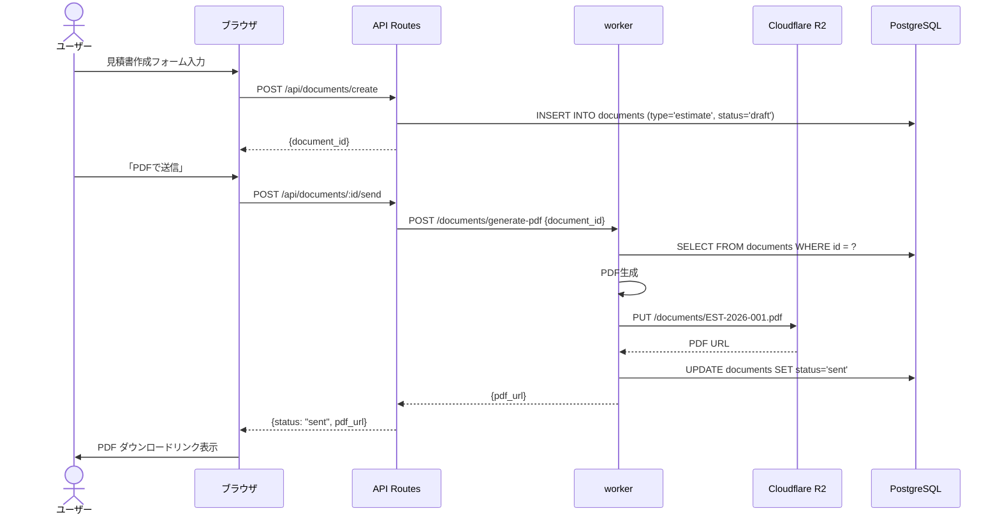
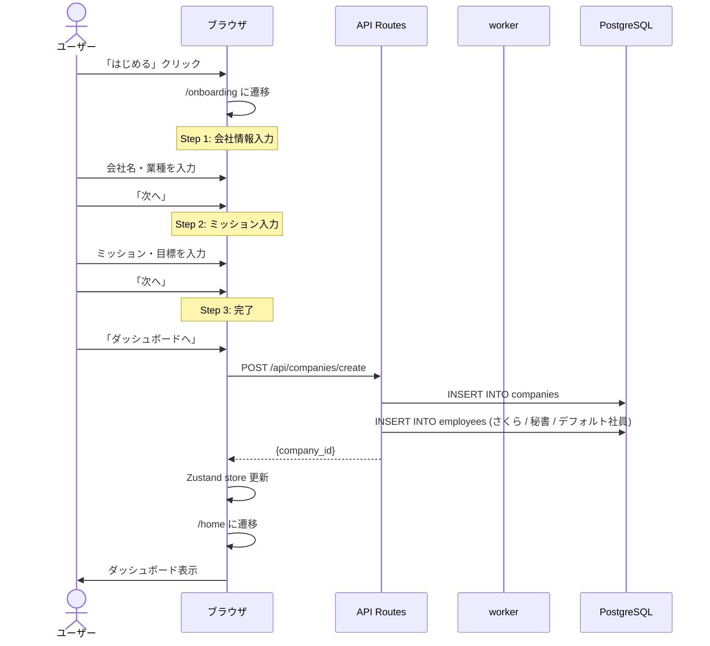
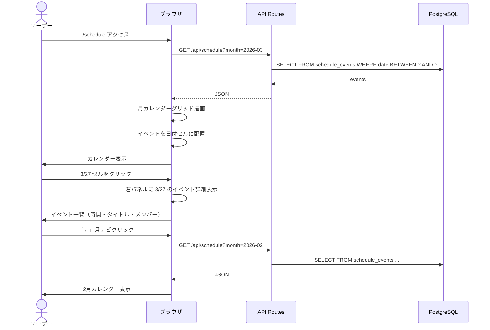
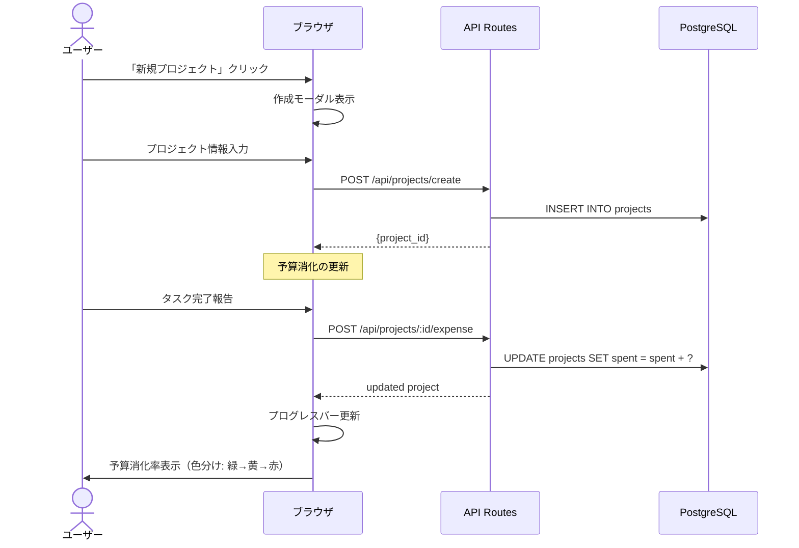
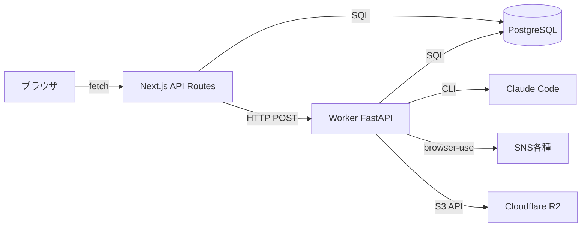

# AI Company - シーケンス図

## 1. ページ表示（一般的なデータ取得）



## 2. チャット（AI社員との会話）



## 3. SNS自動投稿（note.com記事投稿）

```mermaid
sequenceDiagram
    actor User as ユーザー
    participant Browser as ブラウザ
    participant API as API Routes
    participant Worker as worker<br/>(FastAPI)
    participant Claude as Claude Code CLI
    participant BU as browser-use
    participant Note as note.com
    participant R2 as Cloudflare R2
    participant DB as PostgreSQL

    User->>Browser: 「note記事を書いて投稿して」
    Browser->>API: POST /api/tasks/create
    API->>DB: INSERT INTO tasks (status='pending')
    API->>Worker: POST /tasks/execute {type: "sns_post", platform: "note"}
    API-->>Browser: {task_id, status: "accepted"}

    Note over Worker: Phase 1: 記事生成
    Worker->>DB: SELECT FROM companies (ミッション・目標)
    Worker->>Claude: claude --prompt "記事を生成"
    Claude-->>Worker: 記事テキスト + タイトル
    Worker->>DB: UPDATE tasks SET status='in_progress'

    Note over Worker: Phase 2: サムネイル生成（オプション）
    Worker->>R2: PUT /images/thumbnail.png
    R2-->>Worker: URL

    Note over Worker: Phase 3: ブラウザ自動投稿
    Worker->>BU: note.comにログイン（Chrome Profile）
    BU->>Note: ページ操作（タイトル・本文入力）
    Note-->>BU: 投稿完了
    BU-->>Worker: 投稿URL

    Worker->>DB: UPDATE tasks SET status='done', result=投稿URL
    Worker->>DB: INSERT INTO activity_logs (type='sns_post')

    Browser->>API: GET /api/tasks/:id (ポーリング)
    API->>DB: SELECT FROM tasks
    API-->>Browser: {status: "done", result: URL}
    Browser->>User: 完了通知 + 投稿リンク
```

## 4. タスク実行（社員間ハンドオフ）



## 5. 見積書・請求書作成



## 6. オンボーディング（初回セットアップ）



## 7. スケジュール表示（カレンダービュー）



## 8. プロジェクト管理



## 通信まとめ


